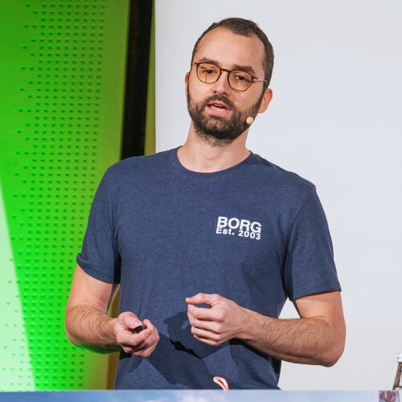

<th1>Teiva Harsanyi</th1>

<th2>Senior Software Engineer at Google</th2>

<th3>Current status: _Writing my [newsletter](https://thecoder.cafe/?rd=teivah.dev)._</th3>

<th2>[:simple-bluesky:](https://bsky.app/profile/teivah.dev)
[:fontawesome-brands-x-twitter:](https://twitter.com/teivah)
[:simple-substack:](https://thecoder.cafe)
[:simple-medium:](https://medium.com/@teivah)
[:simple-github:](https://github.com/teivah)
[:material-linkedin:](https://www.linkedin.com/in/teiva-harsanyi/) </th2>

--- 

I'm a software engineer specializing in **distributed systems, scalability, reliability, and observability topics**. I have extensive experience designing, implementing, and operating reliable systems. Meanwhile, I love meeting challenges, learning, and sharing.

My life philosophy centers around 改善 (Kaizen), meaning "change for the better". In a nutshell, it’s not important how fast you can be; what’s essential is to **improve continuously**. I strive to apply this philosophy to my personal and professional life, constantly seeking to learn and grow.

I have 13 years of experience, and I'm currently working at **Google** as a senior software engineer SRE focusing on the large-scale systems powering Google’s ML infrastructure. Previously, I worked at several companies. At Docker, I maintained systems like Docker registry, Hub, and search. At Beat, an Uber competitor, I was a staff engineer designing and operating critical services focused on reliability and observability. At Utility Warehouse, I led the transformation of the notification platform into scalable microservices, achieving a 90%+ latency reduction. At SkySoft-ATM, I worked in a safety-critical environment in the context of the Swiss air navigation service provider, where I designed, proposed, and implemented the company's central data repository used to store and compute flight events. At Axa and Airbus Helicopters, I also served as a tech lead and architect.

In 2022, I authored [**_100 Go Mistakes and How to Avoid Them_**](book.md), a well-received book (4.7/5 average rating on Amazon, Goodreads, and Manning) that has sold over 10,000 copies globally and been translated into five languages. Additionally, in 2024, I launched [**_The Coder Cafe_**](https://thecoder.cafe/?rd=teivah.dev), a newsletter tailored for software engineers.

I'm also passionate about **open-source** (see my [GitHub](https://github.com/teivah)) and **public speaking** ([my talks](talks.md)).

Interested in connecting? Schedule a free [30-minute session](https://calendly.com/teiva-harsanyi/meet) with me!
