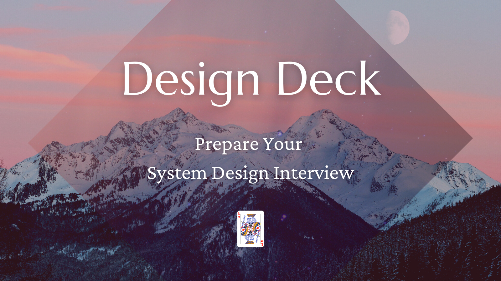

# Coding and System Interviews Preparation

I released two open-source collections of flash cards that helped me land a role as L5 SWE at Google (senior software engineer):

[{width="540"}](https://deckly.dev)
[{width="540"}](https://deckly.dev/designdeck)
