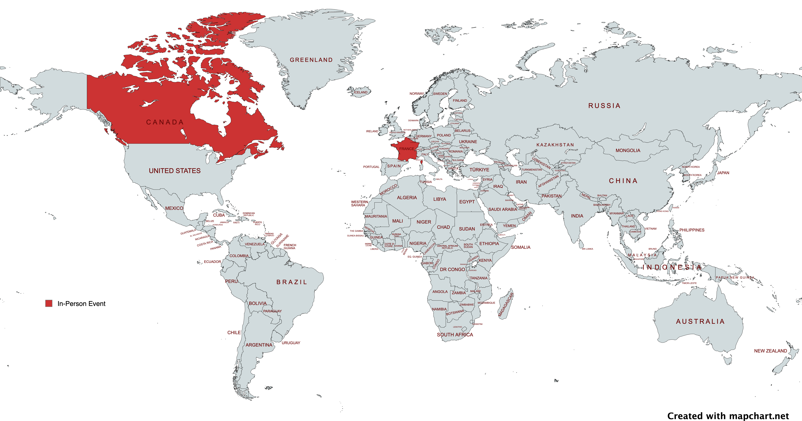

# Teiva Harsanyi's Talks

In-person events:

{width="960"}

## 2024

### 4 Reliability Anti-Patterns - [ConFoo](https://confoo.ca/en/2024/) conference

_Tags: #reliability #sre_

Slides:

<iframe src="https://docs.google.com/presentation/d/e/2PACX-1vSliUbEggyAxG6lXczPtR_lGRR5UIURiEJ3mlyf9Hlw-BNcfxloTWIPcwjmxeAgGxbnIAyodtpuLkEc/embed?start=false&loop=false" frameborder="0" width="960" height="569" allowfullscreen="true" mozallowfullscreen="true" webkitallowfullscreen="true"></iframe>

* [Google Slides](https://docs.google.com/presentation/d/e/2PACX-1vSliUbEggyAxG6lXczPtR_lGRR5UIURiEJ3mlyf9Hlw-BNcfxloTWIPcwjmxeAgGxbnIAyodtpuLkEc/pub?start=false&loop=false&slide=id.g2b9775219ee_0_57)
* [PDF](res/confoo-2024-4-reliability-anti-patterns.pdf)

⭐ Selected as [top 1](https://confoo.ca/en/2024/top) talk of the conference

### I Completed All 9 Advents of Code: Lessons Learned - [ConFoo](https://confoo.ca/en/2024/) conference

_Tags: #coding_

Slides:

<iframe src="https://docs.google.com/presentation/d/e/2PACX-1vS4opZu2emQk76w2u1PD9YZxOpbCY8I-qWbKY6USTCrlHAGlvfirktuINnJKtCwMR3QBpt4-ayLXqQ2/embed?start=false&loop=false" frameborder="0" width="960" height="569" allowfullscreen="true" mozallowfullscreen="true" webkitallowfullscreen="true"></iframe>

* [Google Slides](https://docs.google.com/presentation/d/e/2PACX-1vS4opZu2emQk76w2u1PD9YZxOpbCY8I-qWbKY6USTCrlHAGlvfirktuINnJKtCwMR3QBpt4-ayLXqQ2/pub?start=false&loop=false&resourcekey=0-hBAWmWmBsUFwXVJAk-0KNQ&slide=id.g2b14d668740_2_28)
* [PDF](res/confoo-2024-I-completed-all-9-advents-of-code.pdf)

### 4 Common Go Mistakes - [Golang Insiders](https://twitter.com/i/communities/1685641800449462272) meetup

_Tags: #golang_

Slides:

<iframe src="https://docs.google.com/presentation/d/e/2PACX-1vR9faiR0Maxpfj383l564ib3ch94N8z23MZxqCH-t7AuEiPhkGYWmRXIuHxmRzq1msQGmqjVvz-GLUo/embed?start=false&loop=false" frameborder="0" width="960" height="569" allowfullscreen="true" mozallowfullscreen="true" webkitallowfullscreen="true"></iframe>

* [Google Slides](https://docs.google.com/presentation/d/e/2PACX-1vR9faiR0Maxpfj383l564ib3ch94N8z23MZxqCH-t7AuEiPhkGYWmRXIuHxmRzq1msQGmqjVvz-GLUo/pub?start=false&loop=false)

## 2023

###  Google, Tech, and Go with Teiva Harsanyi - Ardan Labs podcast

_Tags: #golang #career_

<iframe width="960" height="540" src="https://www.youtube.com/embed/RdQMjTgAfDs?si=h_ywNhbvAdF2WvFs" title="YouTube video player" frameborder="0" allow="accelerometer; autoplay; clipboard-write; encrypted-media; gyroscope; picture-in-picture; web-share" allowfullscreen></iframe>

### 3 Reliability Anti-Patterns - [SRE France](https://www.meetup.com/fr-FR/site-reliability-engineering-france/events/296967843/) meetup

_Tags: #reliability # sre_

<iframe width="960" height="540" src="https://www.youtube.com/embed/mpOGwttM_v4?si=BromaslA9OhIB7ZL&amp;start=1552" title="YouTube video player" frameborder="0" allow="accelerometer; autoplay; clipboard-write; encrypted-media; gyroscope; picture-in-picture; web-share" allowfullscreen></iframe>

Slides:

<iframe src="https://docs.google.com/presentation/d/e/2PACX-1vS3r68xeyeqmWys1I5NuQKJPCwNV-qqtpgOT8OJY0GQdg-UeuQLGvgE0-6c4m64A9lfhXK2kX12xH7e/embed?start=false&loop=false" frameborder="0" width="960" height="569" allowfullscreen="true" mozallowfullscreen="true" webkitallowfullscreen="true"></iframe>

* [Google Slides](https://docs.google.com/presentation/d/e/2PACX-1vS3r68xeyeqmWys1I5NuQKJPCwNV-qqtpgOT8OJY0GQdg-UeuQLGvgE0-6c4m64A9lfhXK2kX12xH7e/pub?start=false&loop=false)

### Running a Go App in Kubernetes: CPU Impacts - [P99 Conf](https://www.p99conf.io/) conference

_Tags: #golang #kubernetes #performance_

<iframe width="960" height="540" src="https://www.youtube.com/embed/OEuxfTaRB9Y?si=tjWYqX6XchAcDgS4" title="YouTube video player" frameborder="0" allow="accelerometer; autoplay; clipboard-write; encrypted-media; gyroscope; picture-in-picture; web-share" allowfullscreen></iframe>

Slides:

<iframe src="https://docs.google.com/presentation/d/e/2PACX-1vRabs0KJAXj80z3WzDP40ZAfXBNPKpUiDE2_jgl0jqvXcvw9FcphBj5tlOwRzQUIDE4qMQx6NP37W76/embed?start=false&loop=false" frameborder="0" width="960" height="569" allowfullscreen="true" mozallowfullscreen="true" webkitallowfullscreen="true"></iframe>

### 3 Erreurs Courantes en Go - [Golang Paris](https://www.meetup.com/fr-FR/golang-paris/) meetup

_Tags: #golang_

* Slides:

    * [Keynote](res/golang-paris-2023-3-erreurs-courantes-en-go.key)
    * [PDF (with animations)](res/golang-paris-2023-3-erreurs-courantes-en-go-animations.pdf)
    * [PDF (flat)](res/golang-paris-2023-3-erreurs-courantes-en-go-flat.pdf)

<iframe width="960" height="540" src="https://www.youtube.com/embed/kRohPrlH8Tw?si=B72VtYe45uETzFHw" title="YouTube video player" frameborder="0" allow="accelerometer; autoplay; clipboard-write; encrypted-media; gyroscope; picture-in-picture; web-share" allowfullscreen></iframe>

## 2021

###  How to Make Mistakes in Go - [Go Time](https://changelog.com/gotime) podcast

_Tags: #golang #career_

<iframe width="960" height="540" src="https://www.youtube.com/embed/VGOgDqDe30E?si=HErewJsxDjie92AU" title="YouTube video player" frameborder="0" allow="accelerometer; autoplay; clipboard-write; encrypted-media; gyroscope; picture-in-picture; web-share" allowfullscreen></iframe>

* [Episode](https://changelog.com/gotime/190)
* [Spotify](https://open.spotify.com/episode/0K1DImrxHCy6E7zVY4AxMZ?si=akroInsPQ1mM5B5V2tHLUw&dl_branch=1)

## 2020

### Mechanical Sympathy in Go - [GopherCon Turkey](https://gophercon.ist/) conference

_Tags: #golang #cpu #memory #performance_

<iframe width="960" height="540" src="https://www.youtube.com/embed/cetmDfqr2BU?si=oE-jUe_7DtMlmUip" title="YouTube video player" frameborder="0" allow="accelerometer; autoplay; clipboard-write; encrypted-media; gyroscope; picture-in-picture; web-share" allowfullscreen></iframe>

* Slides:

    * [Keynote](res/gophercon-turkey-2020-mechanical-sympathy.key)
    * [PDF (with animations)](res/gophercon-turkey-2020-mechanical-sympathy-animations.pdf)
    * [PDF (flat)](res/gophercon-turkey-2020-mechanical-sympathy-flat.pdf)
